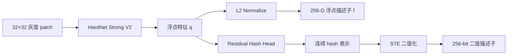

# HardNet Strong V2 与二值描述子训练设计

## 1. 当前方案概览

当前描述子系统分为两个相互隔离的训练阶段：



- 浮点主干：`hardnet_strong_v2`。
- 当前浮点输出：256-D，可通过配置改为其他正整数维度，建议使用 128/256/384/512。
- 浮点匹配距离：L2。
- 二值网络：浮点主干加独立的 `residual_binary_hash_v1` hash head。
- 当前二值输出：256 bit，打包后为 32 bytes。
- 二值匹配距离：Hamming。
- 浮点训练入口：`hardnet_train/train.py`。
- 二值训练入口：`hardnet_train/train_binary.py`。

当前 256-D 配置下的参数量：

| 模块 | 参数量 | 默认二值训练时是否更新 |
| --- | ---: | --- |
| HardNet Strong V2 浮点主干 | 5,855,481 | 否，默认冻结 |
| 256-bit residual hash head | 396,288 | 是 |
| 完整二值网络 | 6,251,769 | 仅 hash head 参与默认训练 |

---

## 2. 浮点主干：HardNet Strong V2

### 2.1 输入与输出契约

输入固定为：

```text
[B, 1, 32, 32]
```

主干同时暴露两种特征：

```text
q: [B, D]  归一化前的连续特征，供二值 hash head 使用
f: [B, D]  L2-normalized 浮点描述子，供浮点训练和 L2 匹配使用
```

其中 `D` 由 `model.descriptor_dim` 控制。当前配置使用：

```yaml
model:
  architecture: hardnet_strong_v2
  descriptor_dim: auto
  dropout: 0.12
  final_bn_affine: false
```

`descriptor_dim: auto` 按架构解析默认维度：Strong V2 为 256-D，`mobile_hardnet` 和原版 `hardnet` 为 128-D。因此只修改 `architecture` 一行即可在保留的网络之间切换。Strong V2 仍是当前唯一的 Strong 架构，原 `hardnet_strong` V1 已从代码中移除。

### 2.2 总体结构

当前 256-D 模型的主要数据流如下：

```text
Input                                      [B,   1, 32, 32]
  │
  ├─ ContrastAwareStem                    [B,  48, 32, 32]
  │
  ├─ StableResBlock ×2                    [B,  48, 32, 32]
  │
  ├─ Box-filter Downsample（2×2 AvgPool） [B,  96, 16, 16]
  │
  ├─ StableResBlock ×3                    [B,  96, 16, 16]
  │        └─ Fine Projection 96→64
  │
  ├─ Box-filter Downsample（2×2 AvgPool） [B, 192,  8,  8]
  │
  ├─ StableResBlock ×4                    [B, 192,  8,  8]
  │
  ├─ 与降采样后的 fine feature 拼接       [B, 256,  8,  8]
  │
  ├─ MultiScaleContext                    [B, 256,  8,  8]
  │
  ├──────────── Spatial Branch ────────────────┐
  │   8×8 → 4×4 → 2×2 → 1×1                  │
  │   输出 [B, D]                              │
  │                                            ├─ Concat [B, 2D]
  └──────────── Global Branch ─────────────────┤
      GeM Pool + Linear 256→D                  │
      输出 [B, D]                              │
                                               ↓
                                      LayerNorm + Dropout
                                               ↓
                                         Linear 2D→D
                                               ↓
                                         BatchNorm1d
                                               ↓
                                      q [B,D] / f [B,D]
```

### 2.3 ContrastAwareStem

Stem 不是单路卷积，而是同时提取三类信息：

1. `3×3` local branch：局部脊线纹理。
2. `5×5` context branch：更大邻域的纹理上下文。
3. contrast branch：先计算 `input - 3×3 average(input)`，再提取局部对比度。

三路各输出 16 个通道，拼接为 48 通道，再通过 `1×1 Conv + GroupNorm + SiLU` 融合。

这样做的目的，是让网络从入口处同时看到原始纹理、宽感受野和局部明暗差异，而不是把所有能力都压在后续卷积中学习。

### 2.4 StableResBlock

每个稳定残差块包含：

```text
输入
  ├─ GroupNorm → SiLU → 3×3 Conv
  ├─ GroupNorm → SiLU → 3×3 Conv
  ├─ Squeeze-Excitation 通道注意力
  ├─ LayerScale
  └─ 与 shortcut 相加
```

关键设计：

- 使用 GroupNorm，不依赖当前 batch 的统计量，对 batch 组成变化更稳定。
- 使用预激活结构，让残差路径更直接。
- 使用 Squeeze-Excitation 强化稳定脊线通道、抑制背景噪声通道。
- 使用初始值为 0.1 的 LayerScale，避免深层残差在训练初期扰动过大。
- 当 `stride=2` 时先使用 `2×2 AvgPool` 下采样，再执行卷积。它相当于盒式低通后抽样，通常比直接 stride 卷积更平滑；但它不是严格的 BlurPool，是否优于论文的 stride 卷积必须通过消融确认。

### 2.5 多尺度特征融合

Stage 2 保留 `[B,96,16,16]` 的细粒度特征，经 `1×1 Conv: 96→64` 和平均池化后变为 `[B,64,8,8]`。

Stage 3 输出 `[B,192,8,8]` 的深层语义特征。

两者拼接为：

```text
192 个深层通道 + 64 个细粒度通道 = 256 个通道
```

这样既保留局部关键点的位置细节，也保留深层网络的判别能力。

### 2.6 MultiScaleContext

多尺度上下文模块包含四个并行分支：

1. `1×1` point branch：逐位置通道混合。
2. depthwise `3×3` local branch：局部邻域纹理。
3. dilation=2 的 depthwise `3×3` branch：更大范围上下文。
4. global average branch：整块 patch 的全局统计。

四路各输出 64 通道，拼接为 256 通道，再与输入投影形成残差融合。

### 2.7 双路描述子头

Strong V2 不只使用全局平均池化，也不只使用单个大卷积，而是保留两条互补路径。

#### Spatial branch

空间分支通过可学习卷积逐步把 `8×8` 压缩到 `1×1`，保留不同空间位置对描述子的贡献：

```text
[B,256,8,8]
→ [B,256,4,4]
→ [B,256,2,2]
→ [B,D,1,1]
→ [B,D]
```

#### Global branch

全局分支使用 GeM：

\[
\operatorname{GeM}(x)=\left(\frac{1}{|\Omega|}\sum_{u\in\Omega}x_u^p\right)^{1/p}
\]

其中 `p` 是可学习参数，初始化为 3，并限制在 `[1,8]`。它能在平均池化和最大响应之间自适应折中。

GeM 输出 256-D 全局向量，再投影到 `D` 维。

#### Fusion

两个分支拼接为 `[B,2D]`，经过：

```text
LayerNorm → Dropout → Linear(2D,D) → BatchNorm1d
```

得到归一化前特征 `q`，最后执行 L2 normalize 得到浮点描述子 `f`。

### 2.8 输出维度与参数量

Strong V2 的输出维度可配置，维度变化会同步调整空间投影、全局投影和融合层。

| `descriptor_dim` | 参数量 | 单个 FP32 描述子大小 |
| ---: | ---: | ---: |
| 128 | 5,592,825 | 512 bytes |
| 256 | 5,855,481 | 1024 bytes |
| 384 | 6,183,673 | 1536 bytes |
| 512 | 6,577,401 | 2048 bytes |

描述子维度增加时，融合层中包含 `2D→D` 投影，因此部分参数量按平方增长。

### 2.9 HardNet 论文原版到底证明了什么

HardNet 论文的标题是 *Working hard to know your neighbor's margins: Local descriptor learning loss*。以下对照主要依据项目内 `hardnet.pdf` 的 3.1、3.2、3.4 和 4.2 节。论文的主要贡献是**采样与损失**，不是提出一套新的复杂主干。作者明确写明：HardNet 的网络结构与 L2Net 相同，只替换训练目标和 batch 内负样本选择方式。

原版 HardNet 的 32×32 灰度 patch 网络为：

| 层 | 操作 | 输出 | 论文中的作用 |
| --- | --- | --- | --- |
| 输入 | 单 patch 减均值、除标准差 | `[B,1,32,32]` | 弱化整体亮度和对比度差异 |
| Conv 1 | `3×3, 1→32, s=1` + BN + ReLU | `[B,32,32,32]` | 提取低层边缘和纹理 |
| Conv 2 | `3×3, 32→32, s=1` + BN + ReLU | `[B,32,32,32]` | 扩展局部表达 |
| Conv 3 | `3×3, 32→64, s=2` + BN + ReLU | `[B,64,16,16]` | 可学习下采样，不使用 pooling |
| Conv 4 | `3×3, 64→64, s=1` + BN + ReLU | `[B,64,16,16]` | 处理中尺度结构 |
| Conv 5 | `3×3, 64→128, s=2` + BN + ReLU | `[B,128,8,8]` | 第二次可学习下采样 |
| Conv 6 | `3×3, 128→128, s=1` + BN + ReLU | `[B,128,8,8]` | 形成最终空间特征图 |
| 正则化 | `Dropout` | `[B,128,8,8]` | 论文初始设置为 0.1 |
| 最终投影 | `8×8, 128→128` + BN，无 ReLU | `[B,128,1,1]` | 保留整个 8×8 网格的可学习空间权重 |
| 输出 | flatten + L2 normalize | `[B,128]` | 得到单位长度描述子 |

论文对架构给出的直接结论只有以下几项：

1. 所有中间卷积后使用 BN 和 ReLU，最后一层不使用 ReLU。
2. 除最终 `8×8` 卷积外，卷积使用 zero padding 保持尺寸。
3. 作者实验中 pooling 会降低描述子性能，所以原版使用 stride 卷积下采样。
4. 输出固定为 128-D，并做 L2 归一化。
5. 输入是逐 patch 标准化的 32×32 灰度图。

论文正文初始实验使用 dropout 0.1；论文的 Post-NIPS 更新又报告，在新版 PyTorch 环境中改为学习率 10、dropout 0.3 后复现更好。因此这些数值是与实现版本绑定的实验设置，不应机械迁移到 Strong V2。

论文消融更强地支持的是训练策略：一个 batch 由 `n` 个正样本对 `(A_i,P_i)` 构成，同一 3D 点在 batch 中只出现一次；计算 `n×n` 的双向距离矩阵，屏蔽对角线，并从行、列两个方向取更近的非匹配样本。margin 为 1 的 triplet loss 为：

\[
L=\frac{1}{n}\sum_i\max\left(0,
1+d(a_i,p_i)-\min\left(
\min_{j\ne i}d(a_i,p_j),
\min_{k\ne i}d(a_k,p_i)
\right)\right)
\]

论文的消融结论是 `hardest-in-batch` 明显优于随机负样本和每轮全数据集 hard mining；后者容易选中标注噪声中的“假负样本”。batch 增大能提供更难负样本，但论文中超过 512 后收益已不明显。这些结论可以支持当前的双向 batch 内挖掘方向，但**不能直接证明 Strong V2 的 Stem、残差、SE、GeM 或双路头一定有效**。

### 2.10 Strong V2 与论文原版的关系

Strong V2 保留了 HardNet 的任务契约，但重做了特征提取主干：

| 设计项 | HardNet 原版 | Strong V2 | 证据归类 |
| --- | --- | --- | --- |
| 输入 | 32×32 灰度、逐 patch 标准化 | 相同；另在裁 patch 时按关键点方向对齐 | 论文支持 + 指纹数据扩展 |
| 下采样次数 | 两次，`32→16→8` | 相同 | 论文结构延续 |
| 下采样方法 | stride `3×3 Conv` | `2×2 AvgPool` 后普通 `3×3 Conv` | 待消融扩展 |
| 归一化 | BatchNorm | 主干 GroupNorm；输出 BatchNorm1d | 待消融扩展 |
| 激活 | ReLU | SiLU | 待消融扩展 |
| 基本块 | 顺序卷积 | 预激活残差块 + SE + LayerScale | 待消融扩展 |
| 多尺度 | 无显式多尺度融合 | Stage 2/3 融合 + 四分支上下文 | 指纹场景合理扩展，待消融 |
| 空间输出 | 单个 `8×8 Conv` | 卷积空间分支 + GeM 全局分支 | 指纹场景合理扩展，待消融 |
| 输出维度 | 固定 128 | 动态 `D`，当前 256 | 工程扩展，待端到端标定 |
| 输出距离 | L2-normalized + L2 | 相同 | 论文契约延续 |
| 负样本 | 双向 top-1 hardest-in-batch | 双向 top-3，并屏蔽物理点组 | 论文方向 + 指纹标签扩展 |
| margin | 1.0 | 当前 0.8 | 待标定扩展 |

这里最重要的边界是：Strong V2 借用了 HardNet 的**描述子学习问题定义**，但它的主干收益需要由当前指纹数据上的消融实验建立，不能用 HardNet 论文结果代替。

### 2.11 Strong V2 每个模块的结构与职责

#### 2.11.1 输入、方向对齐与逐 patch 标准化

网络输入前存在两级处理：

```text
原图关键点 + 方向
  → 围绕关键点旋转对齐
  → 直接裁剪 32×32 灰度 patch
  → 每个 patch 单独执行 (x - mean) / std
  → [B,1,32,32]
```

方向对齐减少网络需要学习的旋转变化；逐 patch 标准化继承 HardNet 原文设置，消除整体亮度和对比度差异。它们不解决局部反光、脊线断裂、弹性形变和方向估计误差，这些仍需主干或受控数据扰动处理。

#### 2.11.2 `ContrastAwareStem`

结构：

```text
输入 [B,1,32,32]
  ├─ 3×3 Conv → GN → SiLU                         16 channels
  ├─ 5×5 Conv → GN → SiLU                         16 channels
  └─ x - AvgPool3×3(x) → 3×3 Conv → GN → SiLU    16 channels
                       ↓ concat
                  [B,48,32,32]
                       ↓
                  1×1 Conv → GN → SiLU
                       ↓
                  [B,48,32,32]
```

作用：

- `3×3` 分支关注局部脊线、边缘和细节点。
- `5×5` 分支在网络入口获得稍大的方向与纹理邻域。
- 对比分支先做固定高通残差，显式突出局部灰度变化；它与逐 patch 标准化不重复，前者处理局部低频背景，后者只处理整块均值和方差。
- `1×1` 融合负责学习三类信号的通道组合，避免三路一直相互隔离。

风险：固定 `3×3` 高通也会放大传感器噪声、压缩伪影和裁剪黑边；`3×3` 与 `5×5` 分支的有效特征可能高度重叠。因此三分支 Stem 必须与普通单路 Stem 做参数量近似的消融。

#### 2.11.3 `StableResBlock`

普通块的数据流为：

```text
x ───────────────────────────────────────────────┐
│                                                │
└→ GN → SiLU → Conv3×3 → GN → SiLU → Conv3×3    │
                         → SE → LayerScale(0.1) ──┤
                                                  + → y
```

下采样块会先对输入做 `2×2 AvgPool, stride=2`，主分支与 shortcut 使用同一份下采样结果；通道变化时 shortcut 再做 `1×1 Conv`。

各子结构职责：

- **预激活残差**：shortcut 不经过激活和归一化，给梯度保留直接路径。
- **GroupNorm**：每个样本独立归一化，不依赖 batch 组成；当前最多 8 组。
- **两层 `3×3` 卷积**：在不改变尺寸时持续扩大感受野并混合邻域信息。
- **SE**：全局平均汇总每个通道，再经 `C→C/4→C` 和 sigmoid 生成通道门控。
- **LayerScale**：每个输出通道有一个可学习缩放，初始值 0.1，使网络训练初期接近 shortcut。
- **盒式低通下采样**：`AvgPool2d(2,2)` 比直接抽样平滑，但不等于严格设计的抗混叠滤波器。

风险：当前配置共使用 11 个 `StableResBlock`，每个块都包含 SE。对于 32×32 patch，深层阶段的特征已是 8×8，重复全局门控可能形成冗余；GroupNorm 在小 batch 下稳定，但当前 batch 为 256，不能先验认定它优于论文的 BatchNorm。

#### 2.11.4 Stage 1：高分辨率局部编码

```text
Stem [B,48,32,32]
  → StableResBlock(48,48) ×2
  → [B,48,32,32]
```

该阶段不下采样，主要保留脊线边缘、分叉、端点及局部方向变化。它承担最细空间结构编码，过早增加通道或下采样都可能丢失定位信息。

#### 2.11.5 Down 1 与 Stage 2：中尺度纹理编码

```text
[B,48,32,32]
  → AvgPool2×2
  → main Conv3×3: 48→96 + Conv3×3: 96→96 + SE
  → shortcut Conv1×1: 48→96
  → [B,96,16,16]
  → StableResBlock(96,96) ×3
  → fine_features [B,96,16,16]
```

该阶段将单条脊线细节组合成邻域纹理和局部几何关系。`fine_features` 不只传给下一阶段，还通过侧路保留给最终上下文模块，避免所有判别信息都必须穿过深层 8×8 表示。

#### 2.11.6 Down 2 与 Stage 3：深层判别编码

```text
[B,96,16,16]
  → AvgPool2×2 + StableResBlock(96,192)
  → [B,192,8,8]
  → StableResBlock(192,192) ×4
  → coarse_features [B,192,8,8]
```

该阶段建立更大范围的组合模式，用于区分外观相似但空间组织不同的脊线块。因为输入仅为 32×32，这一阶段更接近“整块结构编码”，不是通常分类网络中的高层语义。

#### 2.11.7 细粒度侧路融合

```text
fine_features [B,96,16,16]
  → 1×1 Conv + GN + SiLU: 96→64
  → AvgPool2×2
  → fine_context [B,64,8,8]

coarse_features [B,192,8,8]
  + concat
  → [B,256,8,8]
```

`1×1` 投影压缩中层通道并学习通道重组；池化负责尺寸对齐。该侧路的目标是补回深层主路可能损失的位置细节。它与 Stage 3 都来自同一条前向链，因此是多层级融合，不是独立输入尺度。

#### 2.11.8 `MultiScaleContext`

四个并行分支各输出 64 通道：

| 分支 | 结构 | 有效职责 |
| --- | --- | --- |
| point | `1×1 Conv + GN + SiLU` | 逐位置混合 256 个输入通道 |
| local | depthwise `3×3` + `1×1` | 低成本编码相邻位置关系 |
| dilated | dilation=2 depthwise `3×3` + `1×1` | 在 8×8 特征图上扩大上下文范围 |
| global | global average + `1×1`，再广播到 8×8 | 向每个位置注入整块统计信息 |

四路拼接后经 `1×1 Conv + GN` 融合，再乘通道级 LayerScale，与输入的 `1×1` shortcut 相加：

```text
context = shortcut(x) + 0.1-scale × fuse(concat(branches))
```

作用是同时保留当前位置、局部邻域、较大邻域和整块统计。风险在于 dilation=2 的 `3×3` 卷积作用于仅 8×8 的图，边界填充占比较高；global branch 广播的是空间常量，可能与后续 GeM 分支和各残差块中的 SE 重复。

#### 2.11.9 Head 前归一化

`MultiScaleContext` 输出再经过：

```text
GroupNorm(256) → SiLU
```

它把上下文模块残差相加后的数值尺度统一，再送入两个不同统计性质的描述子分支，减少分支入口分布漂移。

#### 2.11.10 Spatial branch

```text
[B,256,8,8]
  → 3×3 Conv, stride=2 + GN + SiLU   [B,256,4,4]
  → 3×3 Conv, stride=2 + GN + SiLU   [B,256,2,2]
  → Dropout2d(p=0.06)
  → 2×2 Conv: 256→D                  [B,D,1,1]
  → flatten                          [B,D]
```

该分支继承了原 HardNet “最终投影应感知空间布局”的思想，但实现不同：原版直接用 `8×8 Conv` 看完整特征图，Strong V2 先通过两次可学习降采样，再用 `2×2 Conv` 汇总。它对关键响应出现在 patch 的哪个位置敏感，适合描述局部细节点的空间组合。

#### 2.11.11 Global branch

```text
[B,256,8,8]
  → GeM(p，初始 3，全模型共享一个标量)   [B,256,1,1]
  → flatten                             [B,256]
  → Linear(256,D)                       [B,D]
```

GeM 的 `p=1` 等价于平均池化，`p` 增大时更强调峰值响应。该分支对小范围位置漂移更稳健，用于补充空间分支的敏感性。它是 Strong V2 的新设计；HardNet 论文“pooling 降低性能”的结论来自原版单路架构，不能直接推出此处辅助全局分支一定有害或一定有效。

当前实现还有一个需要特别验证的数值细节：GeM 输入来自 `GroupNorm → SiLU`，其中包含负数；`GeM.forward()` 会先执行 `clamp_min(1e-6)`，所以所有负响应在全局分支中都被截成近零且没有有效梯度。这不是标准 GeM 对非负激活的常规前提。应比较 `SiLU→clamp`、显式 `ReLU/Softplus→GeM`，或可处理有符号特征的 pooling，确认全局分支不是主要依靠正半轴工作。

#### 2.11.12 Fusion、输出 BN 与 L2 归一化

```text
spatial [B,D] + global [B,D]
  → concat [B,2D]
  → LayerNorm(2D)
  → Dropout(p=0.12)
  → Linear(2D,D)
  → BatchNorm1d(D, affine=False)
  → q [B,D]
  → L2 normalize
  → f [B,D]
```

- `LayerNorm` 先对每条样本的融合向量统一尺度。
- `Linear(2D,D)` 学习两分支之间的联合投影，而不是固定相加。
- `BatchNorm1d(affine=False)` 校准各描述子维度，但不再学习额外缩放和平移。
- L2 归一化把描述子映射到单位超球面，使点积和 L2 距离满足 `d(x,y)=sqrt(2-2xᵀy)`。
- `q` 保留给 hash head，`f` 用于 HardNet metric loss 和浮点匹配。

### 2.12 当前最需要考虑的改进

结论不是立即继续堆模块，而是先验证现有复杂度是否真正贡献。建议使用同一数据划分、同一 sampler、同一训练预算和固定验证协议，一次只改变一个变量。

#### P0：先建立可归因的主干消融

按以下顺序比较，每一步都以上一步胜者为基线：

1. 原版 `HardNet-128` 作为论文基线。
2. 原版宽度/输出改为 256 的容量对照，区分“维度和参数变多”与“模块设计更好”。
3. Strong V2 完整模型。
4. Strong V2 去掉 Global branch，只保留 Spatial branch。
5. Strong V2 去掉 Stage 2 侧路，只用 coarse feature。
6. Strong V2 去掉 `MultiScaleContext`，改为等参数量 `3×3 + 1×1`。
7. Strong V2 去掉所有 SE，或只保留 Stage 3 的 SE。
8. 三路 Stem 替换为参数量接近的单路卷积 Stem。

原因：当前 Stem、多层融合、四分支上下文、逐块 SE、GeM 和双路融合同时存在。如果完整模型提升或下降，现有结构无法判断是哪一个模块导致。

#### P1：优先验证下采样，而不是继续加深

至少比较：

- 论文方式：`3×3 Conv, stride=2`。
- 当前方式：`2×2 AvgPool → 3×3 Conv`。
- 严格低通方式：固定 blur kernel 后 stride=2，再卷积。
- 空间头的两次 `3×3 stride=2 Conv` 也分别比较直接抽样与预滤波抽样，保证“抗混叠”策略前后一致。

当前 `AvgPool2d(2,2)` 只是盒式滤波，而且会引入与原 stride 卷积不同的采样中心。它可能减轻混叠，也可能把相邻细脊线平均掉；HardNet 原文还报告 pooling 会降低性能，因此这是当前最明确、最应优先验证的架构分歧。

#### P1：比较 GroupNorm 与共享统计的 BatchNorm

Strong V2 选择 GroupNorm 的理由是避免依赖 batch；但当前训练 batch 为 256，原论文网络则使用 BatchNorm。建议比较：

- 当前 GroupNorm。
- BatchNorm，但将 anchor 与 positive 在 batch 维拼接后一次前向，再拆回两组，确保两个分支共享完全相同的 batch 统计。
- 若显存限制导致实际 batch 很小，再考虑 GroupNorm 或其他不依赖 batch 的归一化。

这项比较不能只看训练 loss，还要看固定验证集正负距离分布、阈值稳定性和最终身份匹配结果。

#### P1：处理 8×8 上下文模块的重复与边界效应

建议单独比较：

- dilation=2 depthwise `3×3`。
- 普通 depthwise `5×5`，获得密集的 5×5 邻域。
- 删除 global context branch，因为网络已有 11 个 SE 和一个 GeM global branch。

如果删除 global context 或部分 SE 后性能不降，应优先采用更简单结构，减少全局统计的重复注入。

#### P1：验证双路头是否真的互补

分别评估 Spatial-only、Global-only、双路 concat+Linear，并记录：

- patch 正负对距离指标；
- 固定协议上的 TAR/FAR 或当前验证指标；
- 完整模板匹配与 RANSAC 后的身份级指标；
- 参数量、描述子维度和推理成本。

局部 descriptor 最终服务于关键点匹配。Global-only 即使 patch 验证分数较高，也可能因空间辨识不足产生重复脊线误匹配；双路头是否有效必须以完整匹配链路判断。

#### P1：修正或验证 GeM 的非负输入假设

当前 `SiLU` 输出直接进入会 `clamp_min(eps)` 的 GeM，负响应被截断。建议保持其他部分不变，依次比较：

- 当前 `SiLU → clamp → GeM`。
- `ReLU → GeM`。
- `Softplus → GeM`。
- 有符号统计，例如分别池化正、负响应后再投影。

同时记录 GeM 输入中负元素比例、被截断比例和学习后 `p` 的值。这是实现语义问题，优先级高于增加新的 attention 模块。

#### P2：改进裁剪边界而不是增加注意力

当前 Stem 的卷积分支和主干卷积使用 zero padding。指纹 patch 靠边时，零值可能成为可学习的人工边框。可比较 reflect padding，或在训练中引入有效区域 mask。优先检查误匹配是否集中在高空白比例或边缘关键点，再决定是否修改。

#### P2：只加入与实际误差一致的小扰动

patch 已按关键点方向对齐，因此不建议无条件追求旋转不变。更合理的是根据方向估计误差加入小角度旋转、1～2 像素平移、轻微模糊和局部亮度变化。扰动幅度必须保持正样本物理语义，并在 anchor/positive 两侧独立采样。若方向估计本身稳定，旋转等变卷积的复杂度未必有收益。

#### P2：描述子维度应与系统指标联合选择

256-D 比 128-D 容量更大，但融合层含 `2D→D`，参数按 `D²` 增长。应至少比较 128-D 与 256-D，并重新标定 matcher 阈值；不能用旧 128-D 阈值判断 256-D 模型。若 256-D 只改善 patch loss、没有改善身份级匹配，则优先保留 128-D 或压缩融合头。

### 2.13 暂不建议直接做的改动

- 不建议继续增加 Stage 3 深度：32×32 输入在 8×8 阶段已经有较大上下文，当前容量也远高于原版 HardNet。
- 不建议同时加入 Transformer、自注意力、可变形卷积和更多多尺度分支：这会进一步破坏可归因性。
- 不建议先改 loss 来掩盖主干问题：论文已经表明采样策略影响很大，当前 top-3、point-group mask 和 margin=0.8 本身也应独立于主干消融。
- 不建议把 patch 验证指标当作唯一依据：HardNet 论文明确指出 verification 与真实 nearest-neighbor matching 的排序可能不同。

当前最务实的判断是：Strong V2 的模块动机整体合理，尤其是方向对齐、细粒度侧路和空间分支；但网络中全局统计模块偏多，且下采样方式与 HardNet 原文结论存在直接分歧。优先验证下采样、双路头、GroupNorm/BatchNorm 和重复全局上下文，比继续增加新模块更有价值。

---

## 3. 二值描述子网络

### 3.1 浮点维度与二值位数是两个独立参数

定义：

```text
D = float_descriptor_dim
B = hash_bits
```

二值网络执行：

```text
Strong V2 的 q [N,D]
        ↓
ResidualHashHead: D→B→2B→B
        ↓
B-bit binary code
```

`D` 和 `B` 不要求相同。例如以下组合都合法：

```text
128-D float → 256-bit binary
256-D float → 256-bit binary
384-D float → 256-bit binary
512-D float → 384-bit binary
```

当前默认组合是：

```text
256-D float → 256-bit binary → 32 packed bytes
```

`hash_bits` 必须是 `[8,512]` 范围内且为 8 的倍数。

### 3.2 ResidualHashHead

当前 hash head 的结构为：

```text
输入 q [N,D]
  │
  ├─ LayerNorm(D)  （归一化）
  ├─ Linear(D,B, bias=False)                 → base [N,B]   （相当于全连接层）
  │
  ├─ LayerNorm(B)
  ├─ Linear(B,2B)
  ├─ GELU（高斯误差线性单元，transform常用这个）
  ├─ Dropout
  ├─ Linear(2B,B)
  ├─ residual_scale
  └─ 与 base 相加                           → refined [N,B]
       │
       ├─ LayerNorm(B)
       ├─ Linear(B,B)
       ├─ output_scale
       └─ 与 refined 相加                    → logits [N,B]
```

`residual_scale`（残差音量旋钮。） 和 `output_scale`（最后一条输出残差缩放系数） 都初始化为 0.1，使 hash head 从较稳定的近线性投影开始训练，再逐步学习非线性修正。

当前 `D=256`、`B=256`、`hidden_multiplier=2.0` 时，hash head 有 396,288 个参数。

| 层                | 操作                      | 输出     | 作用                                                         |
| ----------------- | ------------------------- | -------- | ------------------------------------------------------------ |
| 输入              | 浮点主干输出连续特征 `q`  | `[N,D]`  | 输入未归一化的浮点描述子，作为 Hash Head 的输入              |
| LayerNorm         | `LayerNorm(D)`            | `[N,D]`  | 对每个样本做归一化，使不同维度数值分布更加稳定，便于后续线性映射 |
| Base Projection   | `Linear(D,B, bias=False)` | `[N,B]`  | 将 D 维浮点描述子映射到 B 维 hash 空间，得到基础 hash 表示（base） |
| LayerNorm         | `LayerNorm(B)`            | `[N,B]`  | 对 base 再次标准化，避免后续 MLP 输入分布漂移                |
| Expand            | `Linear(B,2B)`            | `[N,2B]` | 将特征升维，提高非线性建模能力                               |
| 激活              | `GELU`                    | `[N,2B]` | 引入非线性，使网络能够学习复杂的 bit 之间关系                |
| 正则化            | `Dropout`                 | `[N,2B]` | 防止过拟合，提高泛化能力                                     |
| Compress          | `Linear(2B,B)`            | `[N,B]`  | 将高维特征重新压缩回 B 维，形成残差修正项                    |
| LayerScale        | `residual_scale`          | `[N,B]`  | 使用可学习缩放系数（初始值 0.1）控制残差大小，避免训练初期扰动过大 |
| Residual Add      | `+ base`                  | `[N,B]`  | 将残差修正加回基础表示，得到 refined hash 表示               |
| LayerNorm         | `LayerNorm(B)`            | `[N,B]`  | 对 refined 再次归一化，使最终映射更加稳定                    |
| Output Projection | `Linear(B,B)`             | `[N,B]`  | 对 refined 做最后一次线性校正                                |
| LayerScale        | `output_scale`            | `[N,B]`  | 再次控制最终修正量，保证输出不会突然偏离 refined             |
| Residual Add      | `+ refined`               | `[N,B]`  | 得到最终连续 hash logits                                     |
| 输出              | `logits`                  | `[N,B]`  | 后续经过 `tanh`、STE、`sign` 得到真正的二值码                |

### 3.3 连续表示、STE 表示与真实二值码

hash head 首先输出 `logits`。训练中根据温度 `T` 得到连续表示：

\[
c=\tanh\left(\frac{z}{T}\right)
\]

硬二值值使用：

\[
h=\begin{cases}
+1,&z\ge 0\\
-1,&z<0
\end{cases}
\]

为了让反向传播通过不连续的 sign 操作，使用 Straight-Through Estimator：

\[
h_{ste}=c+\operatorname{stopgrad}(h-c)
\]

因此：

- 前向看到的是确定性的 `-1/+1`。
- 反向梯度近似沿连续 `tanh` 路径传播。
- 推理码直接由 `logits >= 0` 得到 `0/1` bit，不使用连续值冒充二值码。

当前温度从 1.0 指数退火到 0.1：

```text
训练前期：tanh 较平滑，便于优化
训练后期：tanh 更接近 sign，缩小训练与推理差异
```

### 3.4 打包格式

推理阶段可把 `0/1` bit 按 8 位打包为 `uint8`：

| bit 数 | packed bytes |
| ---: | ---: |
| 128 | 16 |
| 256 | 32 |
| 384 | 48 |
| 512 | 64 |

当前默认 `bitorder: little`。checkpoint 会同时保存：

- `descriptor_kind: binary`
- `descriptor_metric: hamming`
- `hash_bits`
- `hash_packed_bytes`
- `binary_bitorder`
- `binary_encoding`
- 浮点主干架构与浮点维度

---

## 4. 数据与 batch 采样

浮点训练和二值训练共用同一套 pair CSV 与 batch sampler。

每条训练记录至少包含：

- anchor patch
- positive patch
- `finger_id`
- `image_pair_id`
- `point_group`

`point_group` 通过 union-find 将跨图连通的同一物理关键点合并。即使 CSV 中只有 A-B、B-C，而没有显式 A-C，A、B、C 也会属于同一组，不能互相作为负样本。

每个 batch 的构造原则：

1. 随机选择 `fingers_per_batch` 根手指。
2. 每根手指只选择一个 `image_pair_id`，限制该手指样本来自同一对图像。
3. 在每根手指内尽量选择不同 `point_group`。
4. 样本不足时允许重复补齐，但重复项会被 `point_group` mask 保护。
5. 整个 batch 不足时丢弃，保证距离矩阵尺寸稳定。

当前 Strong V2 和二值配置均使用：

```text
batch_size = 256
fingers_per_batch = 32
hard_negative_strategy = same_finger_allowed
hard_negative_top_k = 3
```

`same_finger_allowed` 表示允许同一手指内的其他物理点作为负样本，但同一 `point_group` 始终被屏蔽。

另一个可选策略 `different_finger` 会屏蔽同一手指的全部候选，只允许跨手指负样本。

---

## 5. 浮点描述子损失

浮点主干使用 `HardNetLoss`，即带伪负样本屏蔽的 top-k hardest-in-batch triplet margin loss。

### 5.1 距离矩阵

主干输出已经 L2 normalize。对单位向量 `a` 和 `p`：

\[
d(a,p)=\sqrt{\max(2-2a^Tp,\epsilon)}
\]

一个 batch 会计算完整的 anchor-positive 距离矩阵：

\[
D_{ij}=d(a_i,p_j)
\]

对角线 `Dii` 是真实正样本距离。

### 5.2 负样本屏蔽

以下候选不会被当作负样本：

- `i == j` 的真实正样本。
- 与当前样本属于同一 `point_group` 的候选。
- 使用 `different_finger` 策略时，与当前样本属于同一 `finger_group` 的候选。

### 5.3 双向 top-k hardest negative

负样本候选同时来自两个方向：

```text
anchor_i → 所有合法 positive_j
positive_i → 所有合法 anchor_j
```

合并后选择距离最小的 `k` 个合法负样本。当前 `k=3`。

单个负样本的 triplet 损失为：

\[
L_{triplet}=\max(0,m+d_{pos}-d_{neg})
\]

当前浮点配置使用：

```text
margin = 0.8
hard_negative_top_k = 3
```

对每条正样本先平均其有效 top-k 负样本损失，再在有效正样本间取平均，避免合法候选较少的样本被赋予更低权重。

---

## 6. 二值描述子组合损失

二值训练使用六项组合损失：

\[
L=\lambda_mL_{metric}
+\lambda_tL_{teacher}
+\lambda_pL_{positive}
+\lambda_qL_{quant}
+\lambda_bL_{balance}
+\lambda_dL_{decorrelation}
\]

当前权重为：

| 损失项 | 权重 |
| --- | ---: |
| metric | 1.00 |
| teacher similarity | 0.50 |
| positive consistency | 0.10 |
| quantization | 0.10 |
| bit balance | 0.02 |
| bit decorrelation | 0.02 |

### 6.1 Metric loss

先把 STE 的 `-1/+1` 表示做 L2 normalize，再复用浮点阶段的 `HardNetLoss`：

- 同样使用 point/finger group 屏蔽。
- 同样使用双向 top-k hardest negative。
- 当前二值训练 margin 为 0.50。

对固定长度的 `-1/+1` 二值向量，归一化后的 L2 距离与 Hamming 距离单调对应，因此可以沿用可微的度量学习结构。

### 6.2 Teacher relation loss

不强制要求浮点描述子维度 `D` 与二值位数 `B` 相同，而是保持 batch 内样本之间的关系矩阵。

对 teacher 浮点描述子和 student 连续 hash 表示分别计算两两余弦相似度：

\[
S_t=F_tF_t^T,\qquad S_s=F_sF_s^T
\]

损失为非对角元素的均方误差：

\[
\mathcal{L}^{\mathrm{teacher}}=\underset{i\ne j}{\operatorname{mean}}\left(S^\mathrm{t}(i,j)-S^\mathrm{s}(i,j)\right)^2
\]

teacher 特征在该损失中会 `detach`，因此 teacher relation 只作为目标，不会被该项反向改变。

### 6.3 Positive consistency loss

让同一物理点的连续 bit 尽量同号：

\[
L_{positive}=\operatorname{mean}\left[\frac{1-c_a\odot c_p}{2}\right]
\]

当 anchor 和 positive 的对应 bit 同为接近 `+1` 或同为接近 `-1` 时，该项较小。

### 6.4 Quantization loss

推动连续表示远离 0、靠近 `-1/+1`：

\[
L_{quant}=\operatorname{mean}(1-|c|)^2
\]

如果缺少该项，连续空间中表现良好的特征在 sign 后可能发生大量不稳定翻转。

### 6.5 Bit balance loss

希望每个 bit 在一个 batch 中的平均值接近 0：

\[
L_{balance}=\operatorname{mean}\left(\operatorname{mean}_{samples}(c)\right)^2
\]

它用于避免某些 bit 长期全部为 0 或全部为 1，提高 bit 的有效信息量。

### 6.6 Bit decorrelation loss

先对各 bit 去均值并计算协方差矩阵，再惩罚非对角元素：

\[
\mathcal{L}^{\mathrm{decorrelation}}=\underset{i\ne j}{\operatorname{mean}}\left(\operatorname{Cov}(c)(i,j)\right)^2
\]

它用于避免多个 bit 学到重复的判别方向。

---

## 7. 当前训练流程

### 7.1 阶段一：训练 Strong V2 浮点主干

命令：

```powershell
python -m hardnet_train.train --config hardnet_train/config.yaml
```

当前主要配置：

| 项目 | 值 |
| --- | --- |
| architecture | `hardnet_strong_v2` |
| descriptor dim | 256 |
| epochs | 300 |
| steps per epoch | 1000 |
| batch size | 256 |
| fingers per batch | 32 |
| optimizer | SGD + Nesterov |
| learning rate | 0.08 |
| weight decay | 1e-4 |
| scheduler | warmup cosine |
| warmup | 3 epochs |
| eta min | 1e-4 |
| margin | 0.8 |
| top-k negative | 3 |
| mixed precision | FP16 forward，loss 使用 FP32 |

每个 epoch 的流程：

```text
随机训练 batch
  → anchor/positive 前向
  → L2-normalized 浮点描述子
  → HardNet top-k triplet loss
  → 反向传播与 optimizer step
  → 固定验证协议
  → 保存 last.pt
  → 若 FPR@TPR95 更低则保存 best.pt
  → 追加 metrics.csv
```

输出目录：

```text
outputs/models/hardnet_train_strong_v2_256
```

主要产物：

- `best.pt`：固定验证协议下 `FPR@TPR95` 最低的 checkpoint。
- `last.pt`：最后完成 epoch 的 checkpoint。
- `metrics.csv`：每个 epoch 的训练和验证指标。
- `resolved_config.json`：命令行覆盖后的实际配置。

### 7.2 阶段二：冻结主干训练二值 hash head

前提：阶段一已经生成：

```text
outputs/models/hardnet_train_strong_v2_256/best.pt
```

命令：

```powershell
python -m hardnet_train.train_binary --config hardnet_train/config_binary_256.yaml
```

二值入口首先读取浮点 checkpoint，并校验：

- `descriptor_kind` 必须是 `float`。
- `descriptor_metric` 必须是 `l2`。
- architecture 与配置一致。
- descriptor dimension 与配置一致。
- `architecture: auto` 和 `descriptor_dim: auto` 会直接采用 checkpoint 事实值。

当前主要配置：

| 项目 | 值 |
| --- | --- |
| float input | Strong V2 256-D |
| hash bits | 256 |
| packed bytes | 32 |
| backbone trainable | false |
| epochs | 150 |
| steps per epoch | 1000 |
| batch size | 256 |
| optimizer | AdamW |
| learning rate | 1e-3 |
| weight decay | 1e-4 |
| scheduler | warmup cosine |
| warmup | 2 epochs |
| temperature | 1.0 → 0.1 |
| gradient clipping | 5.0 |
| metric margin | 0.50 |

默认 `backbone_trainable: false`，因此主干始终处于 eval 模式，并在 `no_grad` 下提取 teacher 特征。训练只更新 396,288 个 hash head 参数。

每个 epoch 的流程：

```text
加载并冻结浮点 backbone
  → anchor/positive 提取 q 和 f
  → q 进入 residual hash head
  → logits / continuous / STE / code
  → 六项组合损失
  → 梯度裁剪
  → AdamW step
  → 温度继续退火
  → 用真实 0/1 code 做 Hamming 固定验证
  → 保存 last.pt / best.pt / metrics.csv
```

输出目录：

```text
outputs/models/hardnet_binary_256_v1
```

### 7.3 可选阶段三：联合微调

`BinaryDescriptorModel` 支持通过：

```yaml
binary_model:
  backbone_trainable: true
```

让梯度进入浮点主干。但当前实现更适合“从浮点 checkpoint 开始直接联合训练”，尚未提供完整的“读取阶段二最佳二值权重、不恢复旧 optimizer、解冻 backbone、使用分层学习率”的独立微调入口。

因此当前稳定流程是：

```text
阶段一：训练浮点主干
阶段二：冻结主干训练 hash head
```

如果后续增加真正的阶段三，建议满足：

- 从阶段二 `best.pt` 初始化完整模型权重。
- 不恢复阶段二只包含 hash head 的 optimizer state。
- backbone 学习率约为 hash head 的 1/10 或更低。
- 使用新输出目录，避免覆盖阶段二实验。
- 只以真实二值 Hamming 验证结果决定是否采用微调模型。

---

## 8. 固定验证协议

浮点与二值训练都使用与训练 sampler 解耦的 `fixed_pairs_v1`：

```text
seed = 10042
positive_count = 16384
same-finger negatives per anchor = 32
cross-finger negatives per anchor = 32
validation batch size = 256
```

### 浮点验证

- 使用 L2-normalized 浮点描述子。
- 距离为 L2。

### 二值验证

- 使用确定性的 `logits >= 0` 生成真实 `0/1` code。
- 距离为归一化 Hamming 距离：

\[
d_H(x,y)=\frac{1}{B}\sum_{i=1}^{B}[x_i\ne y_i]
\]

- 不使用连续 logits 或 tanh 表示冒充二值验证。

主要验证指标：

- `FPR@TPR95`：主选模指标，越低越好。
- `EER`：等错误率，越低越好。
- `ROC AUC`：越高越好。
- 正样本、同手指负样本、跨手指负样本距离分布。
- 二值专用 `bit_one_fraction`。
- 二值专用 `bit_balance_error`。
- 二值专用 `constant_bit_ratio`。

`best.pt` 统一按最低 `FPR@TPR95` 选择。

---

## 9. Checkpoint 与描述子契约

### 浮点 checkpoint

至少记录：

```text
training_task = float_descriptor
descriptor_kind = float
descriptor_metric = l2
model_architecture = hardnet_strong_v2
descriptor_dim = D
model_parameter_count
model_macs_per_patch
resolved_config
```

恢复训练时会严格校验 architecture、descriptor dimension 和 optimizer 类型，避免不兼容权重误载。

### 二值 checkpoint

至少记录：

```text
training_task = binary_descriptor
descriptor_kind = binary
descriptor_metric = hamming
model_architecture = residual_binary_hash_v1
backbone_architecture
float_descriptor_dim = D
hash_bits = B
hash_packed_bytes
binary_encoding
binary_storage = packed_uint8
binary_bitorder
backbone_trainable
resolved_config
```

浮点维度、二值位数、存储方式或 bit order 不一致时，恢复训练会明确报错，不进行静默 reshape、截断或补零。

---

## 10. 当前使用顺序

```text
1. 训练 Strong V2 浮点模型
   hardnet_train/config.yaml

2. 选择浮点 best.pt
   outputs/models/hardnet_train_strong_v2_256/best.pt

3. 冻结浮点主干，训练 256-bit hash head
   hardnet_train/config_binary_256.yaml

4. 选择二值 best.pt
   outputs/models/hardnet_binary_256_v1/best.pt
```

浮点模型与二值模型必须使用各自的入口和距离度量：

| 描述子 | 训练入口 | 推理距离 |
| --- | --- | --- |
| Strong V2 float | `hardnet_train.train` | L2 |
| Residual binary hash | `hardnet_train.train_binary` | Hamming |

当前 float/L2 matcher 会拒绝 binary/Hamming 模板。二值训练和 Hamming 验证已经实现，但完整的线上 binary matcher、阈值与 RANSAC 标定仍需独立接入。
